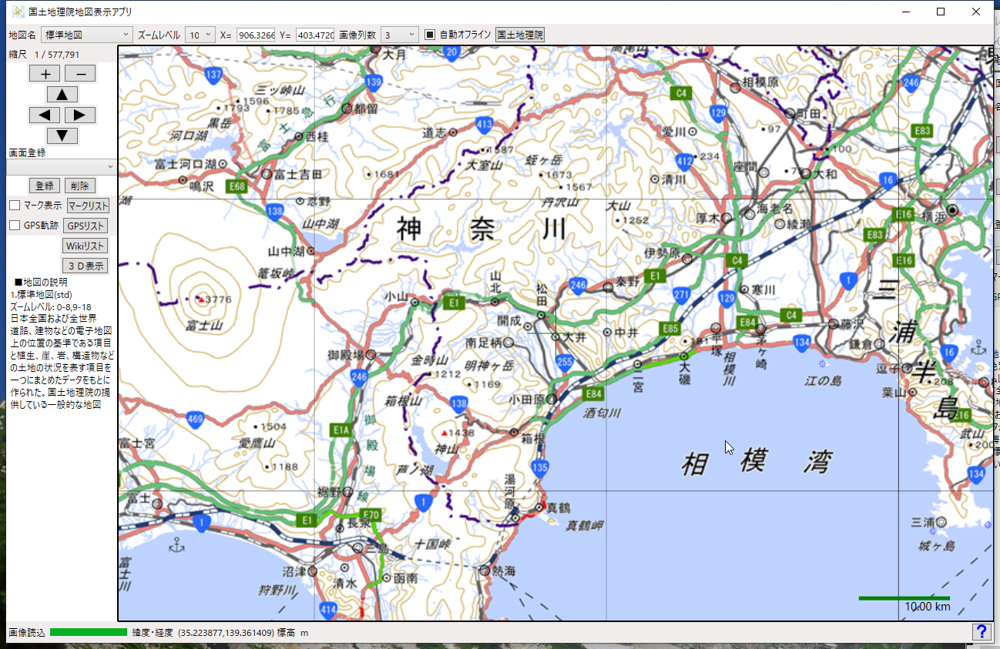
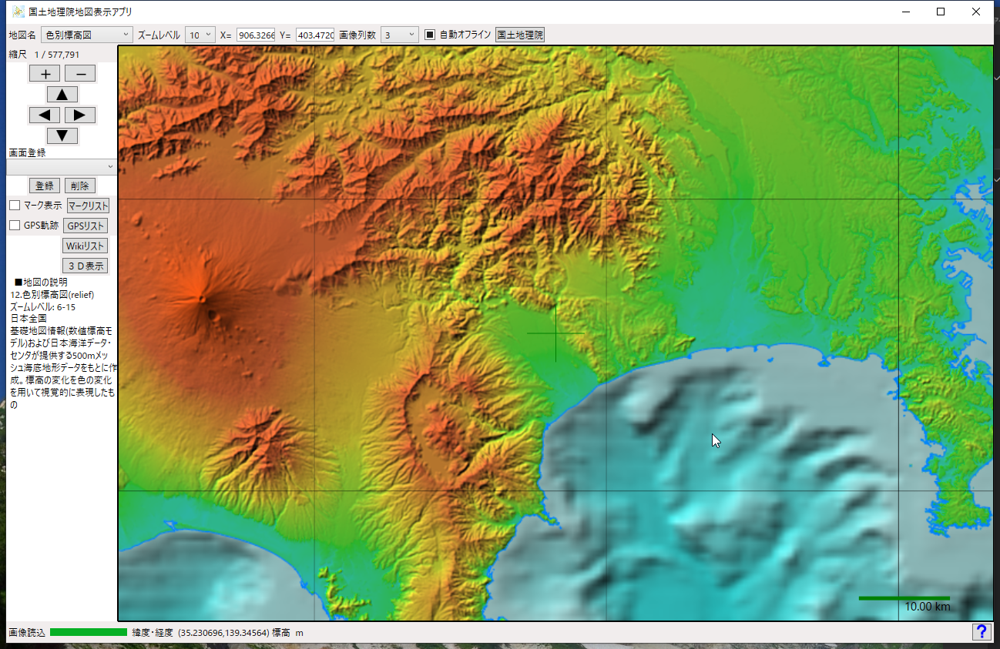
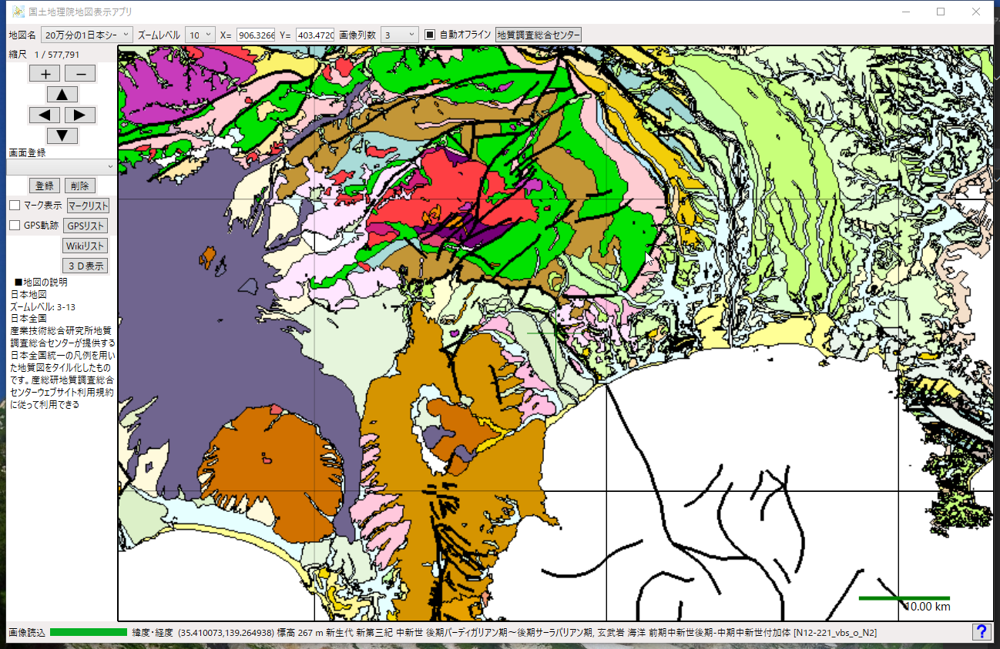
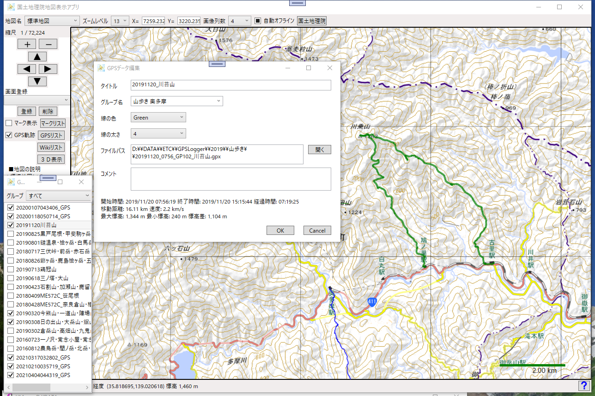
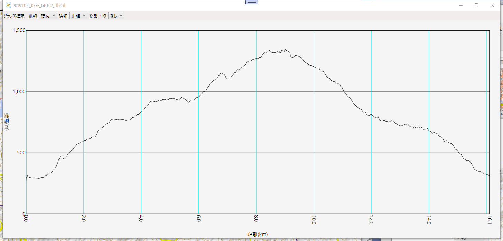
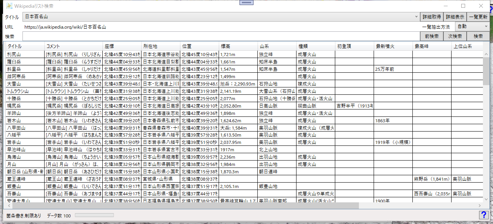
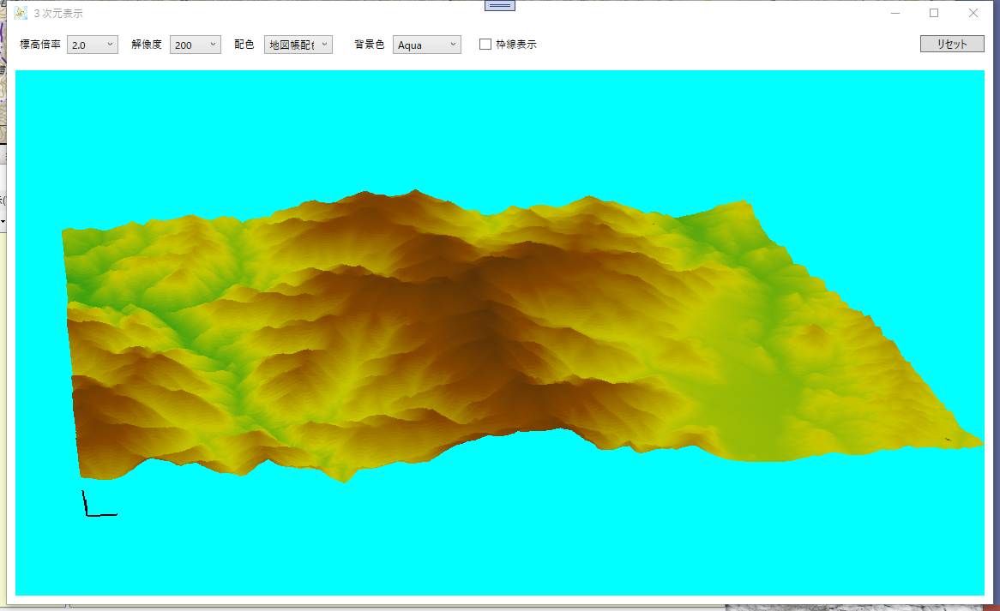

# MapApp
## 国土地理院地図を表示するアプリ

国土地理院のタイル画像を表示するために作成したアプリソフトです。

使い方などは[説明書](bin/Debug/MAPAPP説明書.pdf)を参照。

#### ■おもな機能
**1.Web上で公開されている地図表示**  
　国土地理院の地図と同じ方式が使える他の公開している地図の登録・表示ができる。  
  オープンストリートマップなどを利用すれば海外の地域も同じように見ることができる。(かなり粗いが標高データもあるので三次元表示することも可能)  

　事前登録している地図(16種類)  
　　・国土地理院地図(標準図や航空写真、色別標高図など14種類)  
　　・オープンストリートマップ(OpenStreetMapの世界地図)  
　　・地質調査総合センターで公開している「20万分の1日本シームレス地質図V2」  
　  後から追加も可能  

**標準地図**  
  
**色別標高図**  
  
**20万分の1日本シームレス地質図V2** (マウス位置の地質名を下部ステータスバーに表示)  

**注) 地図の種類によって表示できるズームレベルや地域が限定されていますので、何も表示されない場合には、画面の左に表示されている「地図の説明」で確認してください。**  

**2.地図の解像度変更対応**  
　地図の表示は256x256のタイル画像を並べて表示しているので表示する画像の数を増やすと解像度を高くすることができる(画像列数で設定)のでPCの解像度以上のビットマップデータが作成できる。  

**3.マーク表示**  
　特定の座標を登録でき、その位置に移動することやコメントや参照などを登録できる。
  WikiListで検索したデータもマークとして登録できる。  
    
**4.GPSデータの登録・表示**  
　GPS機能を持った機器でトレースしたGPXデータの登録やトレース表示を行う。  
  
  
  
**5.Wikipediaのデータ参照**  
　Wikipediaには史跡や観光地、博物館、百名山などに位置情報を含むデーが登録されている。  
　これらの情報の一覧を取り込んでそこから位置座標を取出し、その位置に地図を移動させたり、マークの登録を行うことができる。  
  

**6.三次元表示機能**  
　国土地理院の標高データを利用して地図の表示エリアを三次元表示する。  
  

### ■実行環境
MapApp.zipをダウンロードして適当なフォルダに展開し、フォルダ内の MapApp.exe をダブルクリックして実行します。  
初回は画像が乱れることがあるので、その場合は F5 キーで再表示するとなおります。

### ■開発環境  
開発ソフト : Microsoft Visual Studio 2022  
開発言語　 : C# 7.3 Windows アプリケーション  
フレームワーク　 : .NET framework 4.7.2  
NuGetライブラリ : OpenTK(3.3.2),OpenTK.GLControl(3.1.0)  
自作ライブラリ  : WpfLib, Wpf3DLib